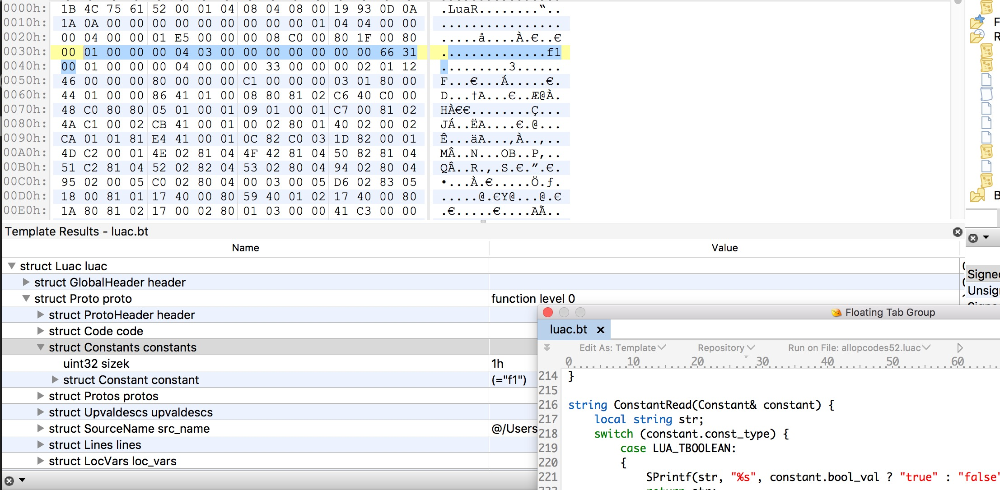

# Lua程序逆向之Luac文件格式分析

Lua语言对于游戏开发与相关逆向分析的人来说并不陌生。Lua语言凭借其高效、简洁与跨平台等多种特性，一直稳立于游戏、移动APP等特定的开发领域中。

目前Lua主要有5.1、5.2、5.3共三个版本。5.1版本的Lua之所以目前仍然被广泛使用的原因之一，是由于另一个流行的项目LuaJit采用了该版本Lua的内核。单纯使用Lua来实现的项目中，5.2与5.3版本的Lua则更加流行。这里主要以Lua版本5.2为例，通过分析它生成的Luac字节码文件，完成Lua程序的初步分析，为以后更深入的反汇编、字节码置换与重组等技能打下基础。

## Lua与Luac

Lua与Python一样，可以被定义为脚本型的语言，与Python生成pyc字节码一样，Lua程序也有自己的字节码格式-luac。Lua程序在加载到内存中后，Lua虚拟机环境会将其编译为Luac（下面文中Luac与luac含义相同）字节码，因此，加载本地的Luac字节码与Lua源程序一样，在内存中都是编译好的二进制结构。

为了探究Luac的内幕，我们需要找到合适的资料与工具来辅助分析Luac文件。最好的资料莫过于Lua的源码，它包含了Lua相关知识的方方面面，阅读并理解Luac的构造与Lua虚拟机加载字节码的过程，便可以通透的了解Luac的格式。但这里并不打算这么做，而采取阅读第三方Lua反编译工具的代码。主要原因是：这类工具的代码往往更具有针对性，代码量也会少很多，分析与还原理解Luac字节码文件格式可以省掉不少的时间与精力。

`luadec`与`unlua`是最流行的Luac反汇编与反编译工具，前者使用C++语言开发，后者使用Java语言，这两个工具都能很好的还原与解释Luac文件，但考虑到Lua本身采用C语言开发，并且接下来打算编写`010 Editor`编辑器的Luac.bt文件格式模板，`010 Editor`的模板语法类似于C语言，为了在编码时更加顺利，这里分析时主要针对`luadec`。

## Luac文件格式

一个Luac文件包含两部分：文件头与函数体。文件头格式定义如下：

```
typedef struct {
    char signature[4];   //".lua"
    uchar version;
    uchar format;
    uchar endian;
    uchar size_int;
    uchar size_size_t;
    uchar size_Instruction;
    uchar size_lua_Number;
    uchar lua_num_valid;
    uchar luac_tail[0x6];
} GlobalHeader;
```

第一个字段`signature`在lua.h头文件中有定义，它是`LUA_SIGNATURE`，取值为“\033Lua"，其中，`\033`表示按键`<esc>`。`LUA_SIGNATURE`作为Luac文件开头的4字节，它是Luac的Magic Number，用来标识它为Luac字节码文件。Magic Number在各种二进制文件格式中比较常见，通过是特定文件的前几个字节，用来表示一种特定的文件格式。

`version`字段表示Luac文件的格式版本，它的值对应于Lua编译的版本，对于5.2版本的Lua生成的Luac文件，它的值为0x52。

`format`字段是文件的格式标识，取值0代表official，表示它是官方定义的文件格式。这个字段的值不为0，表示这是一份经过修改的Luac文件格式，可能无法被官方的Lua虚拟机正常加载。

`endian`表示Luac使用的字节序。现在主流的计算机的字节序主要有小端序`LittleEndian`与大端序`BigEndian`。这个字段的取值为1的话表示为`LittleEndian`，为0则表示使用`BigEndian`。

`size_int`字段表示int类型所占的字节大小。`size_size_t`字段表示size_t类型所占的字节大小。这两个字段的存在，是为了兼容各种PC机与移动设备的处理器，以及它们的32位与64位版本，因为在特定的处理器上，这两个数据类型所占的字节大小是不同的。

`size_Instruction`字段表示Luac字节码的代码块中，一条指令的大小。目前，指令`Instruction`所占用的大小为固定的4字节，也就表示Luac使用等长的指令格式，这显然为存储与反编译Luac指令带来了便利。

`size_lua_Number`字段标识`lua_Number`类型的数据大小。`lua_Number`表示Lua中的`Number`类型，它可以存放整型与浮点型。在Lua代码中，它使用`LUA_NUMBER`表示，它的大小取值大小取决于Lua中使用的浮点数据类型与大小，对于单精度浮点来说，`LUA_NUMBER`被定义为float，即32位大小，对于双精度浮点来说，它被定义为double，表示64位长度。目前，在macOS系统上编译的Lua，它的大小为64位长度。

`lua_num_valid`字段通常为0，用来确定`lua_Number`类型能否正常的工作。

`luac_tail`字段用来捕捉转换错误的数据。在Lua中它使用`LUAC_TAIL`表示，这是一段固定的字符串内容："\x19\x93\r\n\x1a\n"。

在文件头后面，紧接着的是函数体部分。一个Luac文件中，位于最上面的是一个顶层的函数体，函数体中可以包含多个子函数，子函数可以是嵌套函数、也可以是闭包，它们由常量、代码指令、Upvalue、行号、局部变量等信息组成。

在Lua中，函数体使用`Proto`结构体表示，它的声明如下：
```
typedef struct {
    //header
    ProtoHeader header;

    //code
    Code code;

    // constants
    Constants constants;

    // functions
    Protos protos;

    // upvalues
    Upvaldescs upvaldescs;

    // string
    SourceName src_name;

    // lines
    Lines lines;
    
    // locals
    LocVars loc_vars;
    
    // upvalue names
    UpValueNames names;
} Proto;
```

`ProtoHeader`是`Proto`的头部分。它的定义如下：
```
typedef struct {
    uint32 linedefined;
    uint32 lastlinedefined;
    uchar numparams;
    uchar is_vararg;
    uchar maxstacksize;
} ProtoHeader;
```

`ProtoHeader`在Lua中使用`lua_Debug`表示，`lua_Debug`的作用是调试时提供函数的行号，函数与变量名等信息，只是它部分字段的信息在生成Luac字节码时，最终没有写入Luac文件中。`linedefined`与`lastlinedefined`是定义的两个行信息。`numparams`表示函数有几个参数。`is_vararg`表示参数是否为可变参数列表，例如这个函数声明：
```
function f1(a1, a2, ...)
    ......
end
```

这点与C语言类似，三个点“...”表示这是一个可变参数的函数。`f1()`在这里的`numparams`为2，并且`is_vararg`的值为1。

`maxstacksize`字段指明当前函数的Lua栈大小。值为2的幂。

在`ProtoHeader`下面是函数的代码部分，这里使用`Code`表示。`Code`存放了一条条的Luac机器指令，每条指令是一个32位的整型大小。`Code`定义如下：
```
struct Code {
    uint32 sizecode;
    uint32 inst[];
} code;
```

`sizecode`字段标识了接下来的指令条数。`inst`则存放了当前函数所有的指令，在Lua中，指令采用`Instruction`表示，它的定义如下：
```
#define LUAI_UINT32	unsigned int
typedef LUAI_UINT32 lu_int32;
typedef lu_int32 Instruction;
```

当`LUAI_BITSINT`定义的长度大于等于32时，`LUAI_UINT32`被定义为unsigned int，否则定义为unsigned long，本质上，也就是要求`lu_int32`的长度为32位。

接下来是`Constants`，它存放了函数中所有的常量信息。定义如下：
```
typedef struct {
    uint32 sizek;
    Constant constant[];
} Constants;
```

`sizek`字段标识了接下来`Constant`的个数。`constant`则是`Constant`常量列表，存放了一个个的常量信息。的定义如下：
```
typedef struct {
    LUA_DATATYPE const_type;
    TValue val;
} Constant;
```

`LUA_DATATYPE`是Lua支持的各种数据类型结构。如`LUA_TBOOLEAN`表示bool类型，使用`lua_Val`表示；`LUA_TNUMBER`表示数值型，它可以是整型，使用`lua_Integer`表示，也可以是浮点型，使用`lua_Number`表示；`LUA_TSTRING`表示字符串。这些所有的类型信息使用`const_type`字段表示，大小为1字节。

`TValue`用于存放具体的数据内容。它的定义如下：
```
typedef struct {
    union Value {
        //GCObject *gc;     /* collectable objects */
        //void *p;          /* light userdata */
        lua_Val val;        /* booleans */
        //lua_CFunction f;  /* light C functions */
        lua_Integer i;      /* integer numbers */
        lua_Number n;       /* float numbers */
    } value_;
} TValue;
```

对于`LUA_TBOOLEAN`，它存放的值可以通过Lua中提供的宏`bvalue`来计算它的值。
对于`LUA_TNUMBER`，它存放的可能是整型，也可能是浮点型，可以直接通过`nvalue`宏自动进行类型判断，然后获取它格式化后的字符串值。对于Lua的5.3版本，对`nvalue`宏进行了改进，可以使用`ivalue`宏获取它的整型值，使用`fltvalue`宏来获取它的浮点值。
对于`LUA_TSTRING`，它存放的是字符串信息。可以使用`rawtsvalue`宏获取它的字符串信息。而写入Luac之后，这里的信息实则是64位的值存放了字符串的大小，并且紧跟着后面是字符串的内容。

接下来是`Protos`，它表示当前函数包含的子函数信息。定义如下：
```
typedef struct(string level) {
    uint32 sizep;
    Proto proto[];
} Protos
```

`sizep`字段表示当前函数包含的子函数的数目。所谓子函数，指的是一个函数中包含的嵌套函数与闭包。如下面的代码：
```
function Create(n) 
    local function foo1() 
        print(n) 
    end
    local function foo2() 
        n = n + 10 
    end
    return foo1,foo2
end
```

`Create()`函数包含了`foo1()`与`foo2()`两个子函数，因此，这里`sizep`的值为2。`proto`表示子函数信息，它与父函数使用一样的结构体信息。因此，可见Lua的函数部分使用了一种树式的数据结构进行数据存储。

`Upvaldescs`与`UpValueNames`共同描述了Lua中的UpValue信息。当函数中包含子函数或团包，并且访问了函数的参数或局部变量时，就会产生UpValue。如上面的`Create()`函数，`foo1()`与`foo2()`两个子函数都访问了参数`n`，因此，这里会产生一个UpValue，它的名称为“n”。

`Upvaldesc`的定义如下：
```
typedef struct {
    uchar instack;
    uchar idx;
} Upvaldesc;
```

`instack`字段表示UpValue是否在栈上创建的，是的话取值为1，反之为0。`idx`字段表示UpValue在UpValue数据列表中的索引，取值从0开始。

`UpValueNames`存放了当前函数中所有UpValue的名称信息，它的定义如下：
```
typedef struct {
    uint32 size_upvalue_names;
    UpValueName upvalue_name[];
} UpValueNames;
```

`size_upvalue_names`字段表示`UpValueName`条目的数目，每一条`UpValueName`存放了一个UpValue的名称，它的定义如下：
```
typedef struct {
    uint64 name_size;
    char var_str[];
} UpValueName;
```

`name_size`字段是符号串的长度，`var_str`为具体的字符串内容。

`SourceName`存放了当前Luac编译前存放的完整文件名路径。它的定义如下：
```
typedef struct {
    uint64 src_string_size;
    char str[];
} SourceName
```

`SourceName`的定义与`UpValueName`一样，两个字段分别存放了字符串的长度与内容。

`Lines`存放了所有的行号信息。它的定义如下：
```
typedef struct {
    uint32 sizelineinfo;
    uint32 line[];
} Lines;
```

`sizelineinfo`字段表示当前函数所有的行总数目。`line`字段存放了具体的行号。

`LocVars`存放了当前函数所有的局部变量信息，它的定义如下：
```
typedef struct {
    uint32 sizelocvars;
    LocVar local_var[];
} LocVars;
```

`sizelocvars`字段表示局部变量的个数。`local_var`字段是一个个的局部变量，它的类型`LocVar`定义如下：
```
typedef struct {
    uint64 varname_size;
    char varname[];
    uint32 startpc;
    uint32 endpc;
} LocVar;
```

`varname_size`字段是变量的名称长度大小。`varname`字段存放了变量的名称字符串内容。`startpc`与`endpc`是两个指针指，存储了局部变量的作用域信息，即它的起始与结束的地方。

到此，一个Luac的文件格式就讲完了。

## 010 Editor模板语法
为了方便分析与修改Luac二进制文件，有时候使用`010 Editor`编辑器配合它的文件模板，可以达到很直观的查看与修改效果，但`010 Editor`官方并没有提供Luac的格式模板，因此，决定自己动手编写一个模板文件。

`010 Editor`支持模板与脚本功能，两者使用的语法与C语言几乎一样，只是有着细微的差别与限制，我们看看如何编写`010 Editor`模板文件。

点击`010 Editor`菜单Templates->New Template，新建一个模板，会自动生成如下内容：
```
//------------------------------------------------
//--- 010 Editor v8.0 Binary Template
//
//      File: 
//   Authors: 
//   Version: 
//   Purpose: 
//  Category: 
// File Mask: 
//  ID Bytes: 
//   History: 
//------------------------------------------------
```

`File`是文件名，`010 Editor`使用.bt作为模柏树的后缀，这里取名为luac.bt即可。

`Authors`是作者信息。

`Version`是当前模板的版本，如果将最终的模板文件上传到`010 Editor`的官方模板仓库，`010 Editor`会以此字段来判断模板文件的版本信息。

`Purpose`是编写本模板的意图，内容上可以留空。

`Category`是模板的分类，`010 Editor`中自带了一些内置的分类，这里选择`Programming`分类。

`File Mask`是文件扩展名掩码，表示当前模板支持处理哪种文件类型的数据，支持通配符，如果支持多种文件格式，可以将所有的文件扩展名写在一行，中间使用逗号分开，这里设置它的值为“*.luac, *.lua”。

`ID Bytes`是文件开头的Magic Number，用来通过文件的开头来判断是否为支持处理的文件，这里的取值为“1B 4c 75 61”。

`History`中可以留空，也可以编写模板的更新历史信息。

最终，Luac.bt的开头内容如下：
```
//------------------------------------------------
//--- 010 Editor v8.0 Binary Template
//
//      File: luac.bt
//   Authors: fei_cong(346345565@qq.com)
//   Version: 1.0
//   Purpose: 
//  Category: Programming
// File Mask: *.luac, *.lua
//  ID Bytes: 1B 4c 75 61
//   History: 
//      1.0   fei_cong: Initial version, support lua 5.2.
//
// License: This file is released into the public domain. People may 
//          use it for any purpose, commercial or otherwise. 
//------------------------------------------------
```

`010 Editor`模板与C语言一样，支持C语言的宏、数据类型、变量、函数、代码语句、控制流程等，还支持调用常见的C语言函数。

数据类型上，支持的非常丰富，官方列出的支持的数据类型如下：
```
- 8-Bit Signed Integer - char, byte, CHAR, BYTE

- 8-Bit Unsigned Integer - uchar, ubyte, UCHAR, UBYTE

- 16-Bit Signed Integer - short, int16, SHORT, INT16

- 16-Bit Unsigned Integer - ushort, uint16, USHORT, UINT16, WORD

- 32-Bit Signed Integer - int, int32, long, INT, INT32, LONG

- 32-Bit Unsigned Integer - uint, uint32, ulong, UINT, UINT32, ULONG, DWORD

- 64-Bit Signed Integer - int64, quad, QUAD, INT64, __int64

- 64-Bit Unsigned Integer - uint64, uquad, UQUAD, UINT64, QWORD, __uint64

- 32-Bit Floating Point Number - float, FLOAT 

- 64-Bit Floating Point Number - double, DOUBLE 

- 16-Bit Floating Point Number - hfloat, HFLOAT 

- Date Types - DOSDATE, DOSTIME, FILETIME, OLETIME, time_t (for more information on date types see Using the Inspector)
```

在编写模板时，同一数据类型中列出的类型，使用上是一样，如下面的代码片断：
```
local int a;
local int32 a;
local long a;
```

表示的都是一个32位的整型变量，这三种声明方式表达的含义是相同的。声明变量时，需要在前面跟上`local`关键字，如果没有跟上`local`，则表明是在声明一个占位的数据字段。所谓占位的数据字段，指的`010 Editor`在解析模板中的变量时，会对占位的数据部分使用指定的数据类型进行解析，如下面的代码：
```
typedef struct {
    GlobalHeader header;
    Proto proto;
} Luac;

Luac luac;
```

`010 Editor`在解析这段代码时，会按照`Luac`中所有的占位数据字段信息解析当前的二进制文件。`GlobalHeader`与`Proto`的声明也中如此，没有加上`local`的数据字段，都会被`010 Editor`解析并显示。

除了支持基本的C语言格式结构体struct外，`010 Editor`模板语法还加入了一些特性，比如字段注释与格式、结构体压缩与处理函数。看如下的结构体信息：
```
typedef struct {
    uint64 varname_size <format=hex>;
    char varname[varname_size];
    uint32 startpc <format=hex, comment="first point where variable is active">;
    uint32 endpc <format=hex, comment="first point where variable is dead">;
} LocVar <read = LocVarRead, optimize = false>;
```

这是按照前面介绍的`LocVar`结构体信息，按照`010 Editor`模板语法处理过后的效果。为字段后添加`format`可以指定它的输出格式为十六进制hex，默认是10进制；为字段后添加`comment`可以指定它的注释信息，这两个字段可以同时存在，在中间加入一个逗号即可；可以为结构体指定`read`来指定它的类型读取函数，也可以指定`write`来指定它的类型写入函数，`read`与`write`有着自己的格式，如下所示：
```
string LocVarRead(LocVar &val) {
    return val.varname;
}
```

所有的`read`与`write`返回值必须为string，参数必须为要处理的结构体类型的引用。注意：`010 Editor`模板语法不支持指针，但支持引用类型，但引用类型不能作为变量与函数的返回值，只能作为参数进行传递，在编写模板代码时需要注意。

除了以上的基础类型外，`010 Editor`模板还支持字符串类型`string`，这在C语言中是不存在的！它与`char[]`代表的含义是相同的，而且它支持的操作比较多，如以下字符串相加等操作：
```
local string str = "world";
local string str2 = "hello " + str + "!\n";
```

`010 Editor`模板中的宏有限制，并不能解析那些需要展开后替换符号的宏，只支持那些能够直接计算的宏。如下面的`BITRK`与`ISK`宏：
```
#define SIZE_B		9
#define BITRK		(1 << (SIZE_B - 1))
#define ISK(x)		((x) & BITRK)
```

前者可以直接解析并计算出来，`010 Editor`模板就支持它，而对于`ISK`宏，并不能在展开时计算出它的值，因此，`010 Editor`模板并不支持它。

`010 Editor`模板支持enum枚举，与C语言中的枚举的差别是，在定义枚举时可以指定它的数据类型，这样的好处是可以在`010 Editor`模板中声明占位的枚举数据。如下所示是Luac.bt中用到的`LUA_DATATYPE`类型：
```
enum <uchar> LUA_DATATYPE {
    LUA_TNIL		=     0,
    LUA_TBOOLEAN	=	  1,
    LUA_TLIGHTUSERDATA =  2,
    LUA_TNUMBER		=     3,
    LUA_TSTRING		=     4,
    LUA_TTABLE		=     5,
    LUA_TFUNCTION	=     6,
    LUA_TUSERDATA	=     7,
    LUA_TTHREAD		=     8,
    LUA_NUMTAGS	     =    9,
};
```

`010 Editor`模板中支持调用常见的C语言库函数，如`strlen()`、`strcat()`、`print()`、`sprintf()`、`strstr()`，不同的是，函数名上有些差别，这些可调用的函数在`010 Editor`模板中首字母是大写的，因此，在调用时，它们分别是`Strlen()`、`Strcat()`、`Print()`、`Sprintf()`、`Strstr()`。更多支持的字符串操作的函数可以查看`010 Editor`的帮助文档“String Functions”小节，除了“String Functions”外，还有“I/O Functions”、“Math Functions”、“Tool Functions”、“Interface Functions”等函数可供模板代码使用。

接下来看下代码结构部分，`010 Editor`模板支持C语言中的for/while/dowhile等循环语句，这些语句可以用来组成到`010 Editor`模板的函数与代码块中。一点细微的差别是`010 Editor`模板的返回类型只能是上面介绍过的基础类型，不支持自定义类型与数组结构，这就给实际编写代码带来了一些麻烦，遇到这种函数场景时，就需要考虑更改代码的结构了。

## 编写luac.bt文件格式模板

了解了`010 Editor`模板语法后，就可以开始编写Luac.bt模板文件了。编写模板前，需要找好一个Luac文件，然后边写边测试，生成一个Luac文件很简单，可以编写好hello.lua后，执行下面的命令生成hello.luac：
```
$ luac -o ./hello.luac ./hello.lua
```

生成好Luac文件后，就是编写一个个结构体进行测试，这是纯体力活了。`luadec`提供了一个ChunkSpy52.lua，可以使用它打印Luac的文件格式内容，可以参考它的输出进行Luac.bt的编写工作，实际上我也是这么做的。

首先是`GlobalHeader`，它的定义可以这样写：
```
typedef struct {
    uint32 signature <format=hex>;   //".lua"
    uchar version <format=hex>;
    uchar format <comment = "format (0=official)">;
    uchar endian <comment = "1 == LittleEndian; 0 == BigEndian">;
    uchar size_int <comment = "sizeof(int)">;
    uchar size_size_t <comment = "sizeof(size_t)">;
    uchar size_Instruction <comment = "sizeof(Instruction)">;
    uchar size_lua_Number <comment = "sizeof(lua_Number)">;
    uchar lua_num_valid <comment = "Determine lua_Number whether it works or not, It's usually 0">;
    if (version == 0x52) {
        uchar luac_tail[0x6] <format=hex, comment = "data to catch conversion errors">;
    }
} GlobalHeader;
```

这种定义的方式与前面介绍的`LocVar`一样，具体就不展开讨论了。下面主要讨论编写过程中遇到的问题与难点。

首先是输出与ChunkSpy52.lua一样的function level，也就是函数的嵌套级别，定义结构体时可以传递参数，这一点是C语言不具备的，但这个功能非常实用，可以用来传递定义结构时的信息，如这里的function level就用到了该特性。这是`Protos`的定义：
```
typedef struct(string level) {
    uint32 sizep <format=hex>;
    local uint32 sz = sizep;
    local uint32 i = 0;
    local string s_level;
    while (sz-- > 0) {
        SPrintf(s_level, "%s_%d", level, i++);
        Proto proto(s_level);
    };
} Protos <optimize=false>;
```

为结构体加上一个`string`类型的`level`参数，初始时传值“0”，然后往下传递时，为传递的值累加一，这样就做到了function level的输出。


然后是`Constant`常量信息的获取，由于`TValue`支持多种数据的类型，因此在处理上需要分别进行处理，这里参考了`luadec`的实现，不过在细节上还是比较麻烦。`luadec`使用`DecompileConstant()`方法实现，它的代码片断如下：
···
char* DecompileConstant(const Proto* f, int i) {
    const TValue* o = &f->k[i];
	switch (ttype(o)) {
	case LUA_TBOOLEAN:
		return strdup(bvalue(o)?"true":"false");
	case LUA_TNIL:
		return strdup("nil");
#if LUA_VERSION_NUM == 501 || LUA_VERSION_NUM == 502
	case LUA_TNUMBER:
	{
		char* ret = (char*)calloc(128, sizeof(char));
		sprintf(ret, LUA_NUMBER_FMT, nvalue(o));
		return ret;
	}
	case LUA_TSTRING:
        return DecompileString(o);
	default:
		return strdup("Unknown_Type_Error");
	}
}
···

`bvalue`与`nvalue`是Lua提供的两个宏，这在编写模板时不能直接使用，需要自己实现，由于宏的嵌套较多，实际测试时编写了C语言代码展开它的实现，如`nvalue`展开后的实现为：
```
((((((o))->tt_) == ((3 | (1 << 4)))) ? ((lua_Number)(((((o)->value_).i)))) : (((o)->value_).n))));
```

于是编写替换代码`number2str`函数，实现如下：
```
string number2str(TValue &o) {
    local string ret;
    local string fmt;
    if (get_inst_sz() == 4) {
        fmt = "(=%.7g)";
    } else if (get_inst_sz() == 8) {
        fmt = "(=%.14g)";
    } else {
        Warning("error inst size.\n");
    }
    local int tt = o.value_.val.tt_;
    //Printf("tt:%x\n", tt);
    local lua_Integer i = o.value_.i;
    local lua_Number n = o.value_.n;
    SPrintf(ret, "%.14g", ((tt == (3 | (1 << 4))) ? i : n));

    return ret;
}
```

然后为`Constant`编写`read`方法`ConstantRead`，代码片断如下：
```
string ConstantRead(Constant& constant) {
    local string str;
    switch (constant.const_type) {
        case LUA_TBOOLEAN:
        {
            SPrintf(str, "%s", constant.bool_val ? "true" : "false");
            return str;
        }
        case LUA_TNIL:
        {
            return "nil";
        }
        case LUA_TNUMBER:
        {
            return number2str(constant.num_val);
        }
        case LUA_TSTRING:
        {
            return "(=\"" + constant.str_val + "\")";
        }
        ......
        default:
            return "";
    }
}
```

`DecompileConstant`中调用的`DecompileString`方法，原实现比较麻烦，处理了非打印字符，这里简单的获取解析的字符串内容，然后直接返回了。

最后，所有的代码编写完成后，效果如图所示：


luac.bt的完整实现可以在这里找到：[https://github.com/feicong/lua_re](https://github.com/feicong/lua_re)。