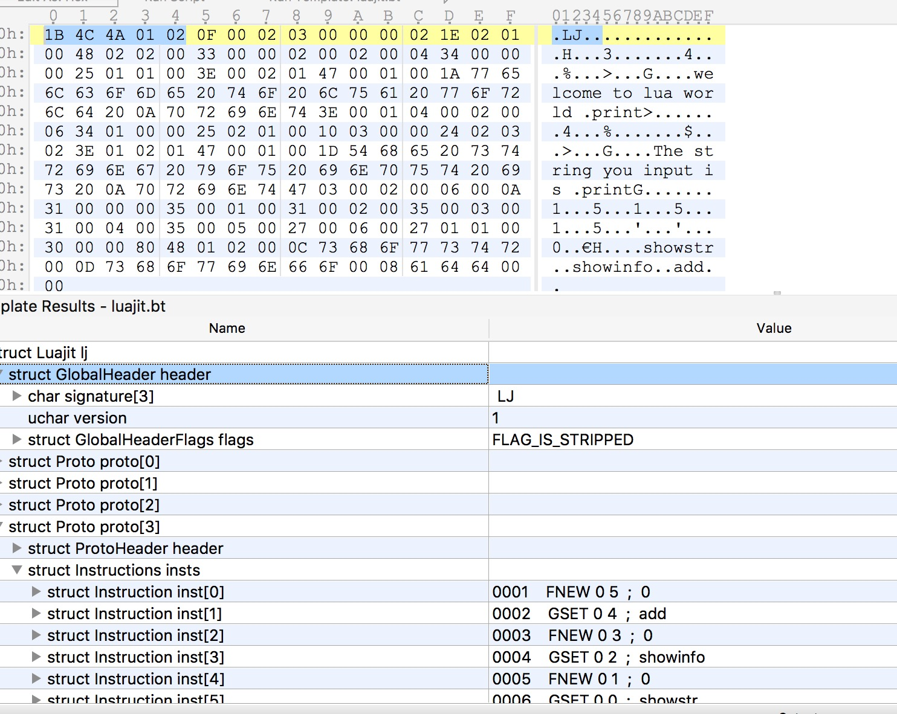

# Lua程序逆向之Luajit字节码与反汇编

`Luajit`的字节码设计与指令的反汇编有很多值得学习的地方。`Luajit`除了将`Lua`原生40条左右的指令扩展到了93条（`Luajit`版本2.0.5）外，还更改了字节码中Opcode与操作数的排列方式，可以说，`Luajit`使用了一种完全全新的方式来编译与执行Lua程序。经过处理后的`Luajit`程序，字节码的编码实现更加简单，执行效率也比原生`Luac`指令更加高效。

## 指令格式分析

`Luajit`很多情况下需要与系统底层打交道，为了方便开发人员扩展与使用`Luajit`，在指令的设计细节上，`Luajit`官方提供了一份完整的指令参考文档。地址是：`http://wiki.luajit.org/Bytecode-2.0`。文档中详细说明了指令的编码格式与各条指令的含义。

首先是指令的编码，`Luajit`指令同样采用等长的32位，指令分为`Opcode`与操作数域两个部分，则每个域占用8字节，如下所示：

```
/* Bytecode instruction format, 32 bit wide, fields of 8 or 16 bit:
**
** +----+----+----+----+
** | B  | C  | A  | OP | Format ABC
** +----+----+----+----+
** |    D    | A  | OP | Format AD
** +--------------------
** MSB               LSB
**
** In-memory instructions are always stored in host byte order.
*/
```

这样做的好处显而易见，在处理32位指令数据时，对于每次只能处理8位的处理器来说，这种对齐后的优化，会减少处理器取指令时的运算周期，提高了指令的执行效率。`Luajit`只支持`ABC`与`AD`两种指令编码形式，其中，`A`、`B`、`C`各占8位，`D`占用16位。在编写解码程序时，代码部分比起`Luac`会简单许多。


### Luajit OpCode

根据定义规则，每条指令最多拥有3个操作数，最少拥有1个操作数。指令的定义可以在`Luajit`源码的lj_bc.h头文件中找到。指令的声明部分采用宏定义，片断如下：

```
#define BCDEF(_) \
  /* Comparison ops. ORDER OPR. */ \
  _(ISLT,	var,	___,	var,	lt) \
  _(ISGE,	var,	___,	var,	lt) \
  _(ISLE,	var,	___,	var,	le) \
  _(ISGT,	var,	___,	var,	le) \
  ......
    _(FUNCF,	rbase,	___,	___,	___) \
  _(IFUNCF,	rbase,	___,	___,	___) \
  _(JFUNCF,	rbase,	___,	lit,	___) \
  _(FUNCV,	rbase,	___,	___,	___) \
  _(IFUNCV,	rbase,	___,	___,	___) \
  _(JFUNCV,	rbase,	___,	lit,	___) \
  _(FUNCC,	rbase,	___,	___,	___) \
  _(FUNCCW,	rbase,	___,	___,	___)

/* Bytecode opcode numbers. */
typedef enum {
#define BCENUM(name, ma, mb, mc, mt)	BC_##name,
BCDEF(BCENUM)
#undef BCENUM
  BC__MAX
} BCOp;
```

所有的指令都使用`BCOp`表示，`BCDEF(BCENUM)`经过宏展开后，会声明每一条`LuaJit`指令。从声明中可以看出，指令由以下五部分组成：

1. name。指令的名称，展开后指令名如`BC_ISLT`、`BC_ADDVV`。
2. ma。指令第一个操作数域，展开后是一个`BCMode`类型常量。
3. mb。指令第二个操作数域，展开后是一个`BCMode`类型常量。
4. mc。指令第三个操作数域，展开后是一个`BCMode`类型常量。
5. mt。指令的类型，展开后是一个一个`MMS`类型常量。

宏声明中的“`___`”展开后是`BCM___`，它被定义为`BCMnone`，即这个域为空，它是`BCMode`的一部分，稍后再讲。

指令列表中，有些指令有添加上一个或多个字符的后缀，来标识指令操作数的类型。它们的取值包括：

- V variable slot。变量槽。
- S string constant。字符串常量。
- N number constant。数值常量。
- P primitive type。原始类型。
- B unsigned byte literal。无符号字节字面量。
- M multiple arguments/results。多参数与返回值。

除了后缀外，部分指令还会有一些约定俗成的前缀，用来标识指令操作的目标数据的类型。例如：

- T table。表。
- F function。函数。
- U UpValue。上值。
- K constant。常量。
- G global。全局。

例如，指令`USETS`是为一个UpValue设置字符串值；指令`TGETV`是获取一个表结构中指定索引的数据。

### `BCMode`

`ma`、`mb`、`mc`展开后是一个`BCMode`类型常量。它们的定义如下：

```
typedef enum {
    BCMnone=0, 
    BCMdst, 
    BCMbase, 
    BCMvar, 
    BCMrbase, 
    BCMuv,
    BCMlit, 
    BCMlits, 
    BCMpri, 
    BCMnum, 
    BCMstr, 
    BCMtab, 
    BCMfunc, 
    BCMjump, 
    BCMcdata,
    BCM_max
} BCMode;
```

当这3个标志的值都不为`BCMnone`时，表示当前指令使用三个操作数，例如`ADDVV`指令声明如下：

```
_(ADDVV,	dst,	var,	var,	add)
```

展开后，变成了：

```
BC_ADDVV,	BCMdst,	BCMvar,	BCMvar,	MM_add
```

即3个操作数都有用到，对于指令0xbbccaa1e，解析它可得知，最低8位0x1e表示为`ADDVV`指令，并且操作数A = 0xaa，B = 0xbb，C = 0xcc。

对于少于3个操作数的情况，即`ma`、`mb`、`mc`中有1个或2个被设置成`BCMnone`，这种情况即为`AD`模式，如果只有一个操作数，则取A部分即可，如果有两个操作数，则取指令高16位为`CD`作为指令的第二个操作数。如指令0x10047，0x47表示它为`RET0`指令，它的指令声明如下：

```
_(RET0,	rbase,	___,	lit,	___)
```

可见，其`mb`为`BCMnone`，，表示第二个操作数不占位，即第三个操作数可以与第二合并为`CD`。此时，第一个参数值A取值为0，第（二/三）个参数CD取值为1，即解析后的指令格式为“`RET0 0 1`”。

### `MMS`

`MMS`为指令的类型，它在`Luajit`源码的lj_obj.h头文件中通过宏定义为如下：

```
#define MMDEF(_) \
  _(index) _(newindex) _(gc) _(mode) _(eq) _(len) \
  /* Only the above (fast) metamethods are negative cached (max. 8). */ \
  _(lt) _(le) _(concat) _(call) \
  /* The following must be in ORDER ARITH. */ \
  _(add) _(sub) _(mul) _(div) _(mod) _(pow) _(unm) \
  /* The following are used in the standard libraries. */ \
  _(metatable) _(tostring) MMDEF_FFI(_) MMDEF_PAIRS(_)

typedef enum {
#define MMENUM(name)	MM_##name,
MMDEF(MMENUM)
#undef MMENUM
  MM__MAX,
  MM____ = MM__MAX,
  MM_FAST = MM_len
} MMS;
```

展开后，定义如下：

```
typedef enum<uchar> {
    MM_index=0, MM_newindex, MM_gc, MM_mode, MM_eq, MM_len, 
    MM_lt, MM_le, MM_concat, MM_call, 
    MM_add, MM_sub, MM_mul, MM_div, MM_mod, MM_pow, MM_unm, 
    MM_metatable, MM_tostring, MM_new, MM_pairs, MM_ipairs,

    MM__MAX,
    MM____ = MM__MAX,
    MM_FAST = MM_len
 } MMS;
```

它们的主要作用是将指令归类，辅助`Luajit`内部执行与调试时使用，对于指令的格式并没有影响，这里不再展开。

### `lj_bc_mode`

`Luajit`将所有的指令模式`BCMode`与`MMS`组合，生成了一张表，它就是`lj_bc_mode`。这张表与`Luac`中的`luaP_opmodes`一样，主要用于辅助指令的解析工作。`lj_bc_mode`的定义是通过builddvm_lib.c中的`emit_lib()`函数执行宏展开的，当`ctx->mode`被定义为`BUILD_bcdef`时，会执行如下片断代码：

```
int i;
fprintf(ctx->fp, "\n};\n\n");
fprintf(ctx->fp, "LJ_DATADEF const uint16_t lj_bc_mode[] = {\n");
fprintf(ctx->fp, "BCDEF(BCMODE)\n");
for (i = ffasmfunc-1; i > 0; i--)
  fprintf(ctx->fp, "BCMODE_FF,\n");
fprintf(ctx->fp, "BCMODE_FF\n};\n\n");
```

整个核心的开展由`BCDEF(BCMODE)`完成。展开后的代码片断如下：

```
const uint16_t lj_bc_mode[] = {(BCMvar|(BCMnone<<3)|(BCMvar<<7)|(MM_lt<<11)), (BCMvar|(BCMnone<<3)|(BCMvar<<7)|(MM_lt<<11)), (BCMvar|(BCMnone<<3)|(BCMvar<<7)|(MM_le<<11)), (BCMvar|(BCMnone<<3)|
......
```

这是一个被定义为每项大小为uint16_t类型，个数为93的数组。可以手工的计算它们生成的值。以`ADDVV`为例，计算如下：

```

_(ADDVV,	dst,	var,	var,	add) \

BCMdst    BCMvar      BCMvar       add
(0x1) | (0x3 << 3) | (0x3 << 7) | (0xA << 11)
>>> Result = 20889 [5199h]

```


当然，也可以使用代码将它们的值打印出来，如下所示：

```
size_t sz = sizeof(lj_bc_mode) / sizeof(uint16_t);
for (size_t i=0; i<sz; i++) {
    std::cout << "idx:" << std::dec << i << ": 0x" 
              << std::hex << lj_bc_mode[i] 
              << std::endl;
}
```

输出如下：

```
idx:0: 0x3183
idx:1: 0x3183
idx:2: 0x3983
idx:3: 0x3983
idx:4: 0x2183
idx:5: 0x2183
idx:6: 0x2503
......
idx:88: 0xb004
idx:89: 0xb004
idx:90: 0xb304
idx:91: 0xb004
idx:92: 0xb004
```

可以看到，与它们的格式相关，输出的效果与`Luac`中的`luaP_opmodes`一样，会有很多的项的值是相同的。

## 反汇编引擎实现

`Luajit`的安装目录下的share/luajit-2.0.5/jit目录中的bc.lua文件为`Luajit`提供的反汇编模块，可以使用它来完成`Luajit`字节码文件的反汇编工作。执行如下命令，可以查看hello.lua的指令信息：

```
$ luajit -jbc ./hello.lua
-- BYTECODE -- hello.lua:2-4
0001    ADDVV    2   0   1
0002    RET1     2   2

-- BYTECODE -- hello.lua:5-7
0001    GGET     0   0      ; "print"
0002    KSTR     1   1      ; "welcome to lua world "
0003    CALL     0   1   2
0004    RET0     0   1

-- BYTECODE -- hello.lua:9-11
0001    GGET     1   0      ; "print"
0002    KSTR     2   1      ; "The string you input is "
0003    MOV      3   0
0004    CAT      2   2   3
0005    CALL     1   1   2
0006    RET0     0   1

-- BYTECODE -- hello.lua:0-14
0001    FNEW     0   0      ; hello.lua:2
0002    GSET     0   1      ; "add"
0003    FNEW     0   2      ; hello.lua:5
0004    GSET     0   3      ; "showinfo"
0005    FNEW     0   4      ; hello.lua:9
0006    GSET     0   5      ; "showstr"
0007    KSHORT   0   6
0008    KSHORT   1   1
0009    UCLO     0 => 0010
0010 => RET1     1   2
```

当然，也可以使用它直接反汇编`Lua`代码生成指令信息，如下所示：

```
$ luajit -jbc -e 'local x=0; for i=1,1e6 do x=x+i end; print(x)'
-- BYTECODE -- (command line):0-1
0001    KSHORT   0   0
0002    KSHORT   1   1
0003    KNUM     2   0      ; 1000000
0004    KSHORT   3   1
0005    FORI     1 => 0008
0006 => ADDVV    0   0   4
0007    FORL     1 => 0006
0008 => GGET     1   0      ; "print"
0009    MOV      2   0
0010    CALL     1   1   2
0011    RET0     0   1
```

如果要查看已经生成的hello.luajit的指令信息，可以使用`Luajit`的-bl参数，执行如下命令，与上面`luajit -jbc`的输出是一样的：

```
$ luajit -bl ./hello.lua
```

bc.lua中提供了`bcline()`反汇编引擎来实现指令的反汇编，它基于`lj_bc_mode`返回的指令`BCMode`来生成`ma`、`mb`与`mc`，但没有经过移位处理，如果没`Luajit`的指令格式不太熟悉，可能不能马上理解它的含义。当然，编写指令解析时，也可以直接本地定义一份指令Opcode与模式之前的表，解析时不需要用到`lj_bc_mode`，并且解析速度更快，反汇编工具`ljd`就是这么干的。下面，我们为`010 Editor`编写反汇编引擎时，由于模板语法的限制，最终选择了结合它们两种的处理方法。

编写基本的Luajit.bt功能之前已经实现，这里主要集中在反汇编引擎`InstructionRead()`的实现上，由于指令中需要用到当前指令地址`pc`以及指令中访问同级常量表中的信息，因此，对Luajit.bt进行了之前Luac.bt一样的重构，将当前`Proto`中所有的指令`Instruction`封装成`Instructions`，然后内联声明到`Proto`中，如下所示：

```
typedef struct {
    ProtoHeader header;

    typedef struct(int inst_count) {
        local int pc = 1;
        local int inst_count_ = inst_count;
        while (inst_count_-- > 0) {
            Instruction inst(pc);
            pc++;
        }
    } Instructions;

    if (uleb128_value(header.size) > 0) {
        if (uleb128_value(header.instructions_count) > 0)
            local int inst_count = uleb128_value(header.instructions_count);
            Instructions insts(inst_count);
        if ((header.upvalues_count == 0) && (uleb128_value(header.complex_constants_count) == 0) && (uleb128_value(header.numeric_constants_count) == 0)) {
        } else {
            Constants constants(header.upvalues_count, uleb128_value(header.complex_constants_count), uleb128_value(header.numeric_constants_count));
        }
            
        if (header.debuginfo_size_ > 0)
            DebugInfo debuginfo(uleb128_value(header.first_line_number), uleb128_value(header.lines_count), uleb128_value(header.instructions_count), header.debuginfo_size_, header.upvalues_count);

        local int64 end = FTell();
        if (uleb128_value(header.size) != end - header.start) {
            Warning("Incorrectly read: from 0x%lx to 0x%lx (0x%lx) instead of 0x%lx\n", header.start, end, end - header.start, uleb128_value(header.size));
        }
    }
} Proto <optimize=false>;
```

这样做之后，可以通过`parentof(parentof(inst))`访问到指令所在的`Proto`信息，进行获取`Proto`中其他字段的信息。

反汇编引擎的实现分为以下几步：

1. 获取指令`BCOp`，解析不同的指令。
2. 解析与处理指令的参数，这里通过`BCMode`来完成。
3. 字符串与跳转处理。达到更好的反汇编输出效果。
4. 输出指令`BCOp`与操作数，完成指令反汇编引擎。

### 指令`BCOp`解析

解析指令的`BCOp`很简单，只需要取指令的最低8位即可，获取指令`BCOp`只需要如下一行代码：

```
local INSTRUCTION_OPCODES op = (INSTRUCTION_OPCODES)codeword & 0xff;
```

这里的`INSTRUCTION_OPCODES`为声先声明好的指令枚举类型。获取指令`BCOp`后，需要处理指令的参数。`010 Editor`模板不支持定义的本地数组结构直接赋值，因此，只能声明一个数组后，一行行的赋值，比较尴尬，代码片断如下：

```
local uint16 modes[93];

void init_modes() {
    modes[0] = 0x3183;
    modes[1] = 0x3183;
    modes[2] = 0x3983;
    ......
    modes[91] = 0xb004;
    modes[92] = 0xb004;
}
```

`init_modes()`需要在模板最外层，`Luajit lj;`声明前调用一次。然后在代码中就可以访问每一条指令对应的Mode了，编写代码如下：

```
uint16 get_mode(INSTRUCTION_OPCODES op) {
    return modes[op];
}

BCMode get_mode_a(INSTRUCTION_OPCODES op) {
    return get_mode(op) & 7;
}

BCMode get_mode_b(INSTRUCTION_OPCODES op) {
    return (get_mode(op) >> 3) & 15;
}

BCMode get_mode_c(INSTRUCTION_OPCODES op) {
    return (get_mode(op) >> 7) & 15;
}
```

### 参数处理

参数的处理不难，根据前面分析的规则，通过`ma`、`mb`、`mc`的值即可完成。首先，需要判断参数的个数是否为3个，然后，通过它来确定是`ABC`还是`AD`模式，代码如下：

```
int get_args_count(INSTRUCTION_OPCODES op) {
    local int count = 0;
    local BCMode ma = get_mode_a(op);
    local BCMode mb = get_mode_b(op);
    local BCMode mc = get_mode_c(op);
    if (ma != BCMnone)
        count++;
    if (mb != BCMnone)
        count++;
    if (mc != BCMnone)
        count++;
    return count;
}
```

获取参数个数后，就可以设置`A`、`B`、`CD`的值了。代码片断如下：

```
local int args_count = get_args_count(op);
local int A=0, B=0, CD=0;
if (args_count == 3) {
    A = (codeword >> 8) & 0xFF;
    CD = (codeword >> 16) & 0xFF;
    B = (codeword >> 24) & 0xFF;
} else {
    A = (codeword >> 8) & 0xFF;
    CD = (codeword >> 16) & 0xFFFF;
}
```

### 字符串与跳转处理

获取了`A`、`B`、`CD`的值后，并不能直接输出反汇编，因为，针对不同类型的指令操作数，它的取值可能需要进行处理。例如对于`BCMstr`、`BCMtab`、`BCMfunc`、`BCMcdata`类型的操作数，它表示的是一个`ComplexConstant`的索引值，需要到指令所在的`Proto`的`ComplexConstant`中取数据，而且取数据的索引值与需要从`ComplexConstant`表相反的方向进行获取，即如下的代码所示：

```
local int idx = complex_constants_count - operand - 1;
```

还有，针对`BCMjump`类型的操作数，它跳转的地址计算方法是当前操作数的值加上当前指令`pc`减去0xFFFF。

终上所述，可以写出指令操作数处理函数`process_operand()`，代码如下：

```
string process_operand(Instruction &inst, int complex_constants_count, BCMode operand_type, int operand, int pc) {
    local string str;
    if ((operand_type == BCMstr) || 
            (operand_type == BCMtab) || 
            (operand_type == BCMfunc) || 
            (operand_type == BCMcdata)) {
        local int idx = complex_constants_count - operand - 1;
        SPrintf(str, "%d  ;  %s", idx, get_data_from_constants(inst, idx));
    } else if (operand_type == BCMjump) {
        SPrintf(str, "==> %04d", operand + pc - 0x7FFF);
    } else {
        SPrintf(str, "%d", operand);
    }
        return str;
}
```

`get_data_from_constants()`的代码如下：

```
string get_data_from_constants(Instruction &inst, int idx) {
    local string str = ComplexConstantRead(parentof(parentof(inst)).constants.constant[idx]);
    if (str == "BCDUMP_KGC_CHILD")
        return "0";
    else
        return str;
}
```

`complex_constants_count`与`inst`一起作为参数传递，而不是在`process_operand()`中计算获取，是因为该方法会被多次调用，这样做可以提高代码执行效率。

### 完成指令反汇编引擎

最终，完成指令的反汇编引擎代码如下：

```
string InstructionRead(Instruction &inst) {
    local uint32 codeword = inst.inst;
    local INSTRUCTION_OPCODES op = (INSTRUCTION_OPCODES)codeword & 0xff;
    local uint16 mode = get_mode(op);
    local BCMode ma = get_mode_a(op);
    local BCMode mb = get_mode_b(op);
    local BCMode mc = get_mode_c(op);
    local int args_count = get_args_count(op);

    local int A=0, B=0, CD=0;
    if (args_count == 3) {
        A = (codeword >> 8) & 0xFF;
        CD = (codeword >> 16) & 0xFF;
        B = (codeword >> 24) & 0xFF;
    } else {
        A = (codeword >> 8) & 0xFF;
        CD = (codeword >> 16) & 0xFFFF;
    }

    local int complex_constants_count = uleb128_value(parentof(parentof(inst)).header.complex_constants_count);
    local string tmp;
    SPrintf(tmp, "%04d    ", inst.pc_);
    local string line = tmp + EnumToString(op);
    if (ma != BCMnone) {
        SPrintf(tmp, "%s", process_operand(inst, complex_constants_count, ma, A, inst.pc_));
        line += " " + tmp;
    }
    if (mb != BCMnone) {
        SPrintf(tmp, "%s", process_operand(inst, complex_constants_count, mb, B, inst.pc_));
        line += " " + tmp;
    }
    if (mc != BCMnone) {
        SPrintf(tmp, "%s", process_operand(inst, complex_constants_count, mc, CD, inst.pc_));
        line += " " + tmp;
    }

    return line;
}
```
 
 使用`010 Editor`打开hello.luajit，并加载编写好的模板，效果如图所示：
 

 完整的luajit.bt文件可以在这里找到：[https://github.com/feicong/lua_re](https://github.com/feicong/lua_re)。
